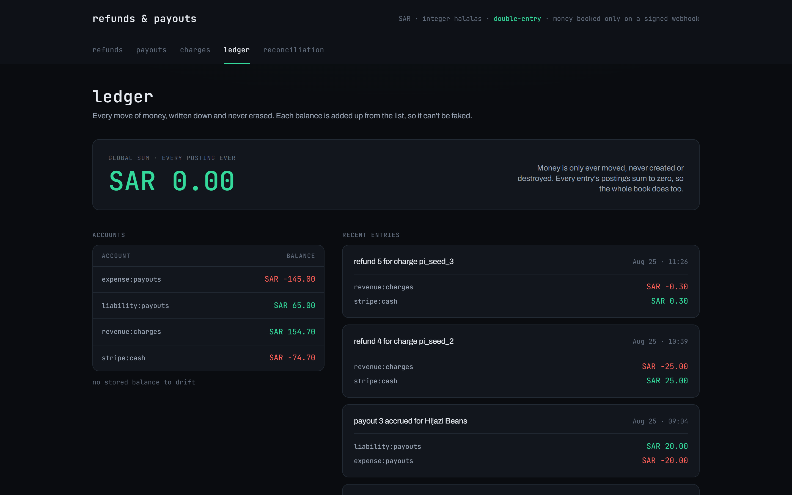
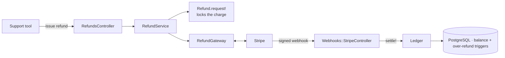

<div align="center">

# Refunds & Payouts Ledger

The outbound half of a payments system: a refund state machine, idempotent
reversals, and a double-entry ledger that stays balanced through partial
refunds. Built in Rails 8.

[](https://rails-refunds-system.onrender.com)
[](https://github.com/MohammedAltounsi/rails-refunds-system/actions/workflows/ci.yml)


### [▶ Open the live demo](https://rails-refunds-system.onrender.com)

Issue a refund, replay the settlement webhook, and watch the ledger stay
balanced. No setup, no Stripe account, no real money.

<br>



</div>

This is the companion to
[rails-stripe-wallet-ledger-sandbox](https://github.com/MohammedAltounsi/rails-stripe-wallet-ledger-sandbox),
which builds the inbound half (capture a payment, credit a wallet). This repo
builds the harder direction: giving money back correctly, exactly once, even
when a refund is partial, a webhook is redelivered, or a request is retried.

## What it does

| Area | What happens | Where |
|---|---|---|
| Refund state machine | `requested → processing → settled \| failed`. Every other transition raises `Refund::InvalidTransition`. | `app/models/refund.rb` |
| Over-refund guard | A charge can never be refunded past what it captured, even split across concurrent requests. Enforced in the app (a row lock on the charge) AND in Postgres (a deferred `CONSTRAINT TRIGGER`). | `Refund.request!`, `lib/tasks/db_constraints.rake` |
| Idempotent reversals | Settling a refund posts a balancing ledger entry, keyed on the refund. A redelivered webhook reverses the money once. | `Refund#settle!`, `app/models/ledger.rb` |
| Stripe refunds | Created via the Refund API (test mode). Money is booked only on a signature-verified `refund.updated` webhook, never on the synchronous create response. | `app/models/refund_gateway.rb`, `app/controllers/webhooks/stripe_controller.rb` |
| Webhook inbox | Every Stripe event recorded once (unique `event_id`); a redelivery of an already-processed event is a no-op. | `app/models/stripe_event.rb` |
| Payouts | The outbound-to-payee half: requesting a payout accrues the liability in the same transaction, and the cash is disbursed only on a verified `payout.paid` webhook. Same idempotency, state machine, and double-entry discipline as a refund. | `app/models/payout.rb` |
| Reconciliation | Compares settled refunds against Stripe and reports dropped webhooks, amount mismatches, and orphan reversals. Every run is stored, so drift has a timeline; a Stripe outage reports `unreachable` instead of false orphans. | `app/services/reconciliation_service.rb`, `app/models/reconciliation_run.rb` |
| Recovery sweep | Any webhook event stuck unprocessed (a crash-dropped settlement) is re-run and healed automatically. | `app/jobs/reprocess_stuck_stripe_events_job.rb` |
| JSON API | `POST /api/refunds` honors an `Idempotency-Key` header exactly like Stripe's own API. Spec at `/openapi.yaml`. | `app/controllers/api/refunds_controller.rb` |
| Audit + access | Every issued refund and payout records an actor and an action. Money-moving actions sit behind Basic auth when `ADMIN_PASSWORD` is set. | `app/models/audit_log.rb` |

## How it works



1. `Refund.request!` locks the charge, checks the remaining refundable amount,
   and creates the refund row, idempotent on a caller-supplied key.
2. `RefundGateway` calls Stripe. The refund moves to `processing`. A
   synchronous Stripe error fails it immediately; nothing is booked either way.
3. Stripe's `refund.updated` webhook (signature-verified, deduped through the
   inbox) is the only thing that calls `Refund#settle!`, which flips the
   status to `settled` and posts the balancing reversal in one transaction.
4. A redelivered webhook, a retried request, or a double-click all resolve to
   money moving exactly once. The idempotency keys guarantee it, and the
   database enforces it independently of the app.

For the reasoning behind each decision, see [ARCHITECTURE.md](ARCHITECTURE.md).
For what to do when reconciliation reports drift, see [RUNBOOK.md](RUNBOOK.md).
For every route this app exposes, see [API.md](API.md).

## Run it

The fastest way to see it work is the **[live demo](https://rails-refunds-system.onrender.com)** —
it runs the full refund flow in the browser and replays webhooks for you, no
install. To run it locally against real Stripe test webhooks:

Needs Ruby 4.0+, the [Stripe CLI](https://stripe.com/docs/stripe-cli), and a Stripe test account.

```bash
bundle install
bin/rails db:setup
```

Put your test key in `.env.local` (gitignored):

```
STRIPE_SECRET_KEY=sk_test_...
STRIPE_WEBHOOK_SECRET=whsec_...
```

Run the app and the webhook tunnel in two shells:

```bash
bin/rails server
stripe listen --forward-to localhost:3000/webhooks/stripe --events refund.updated,refund.failed
```

Open <http://localhost:3000>. Issue a refund from `/refunds/new`, watch it
settle when the webhook arrives, and check `/ledger` and `/reconciliation`.

## Tests

```bash
bin/rails test
```

Covers every legal and illegal state transition, the over-refund guard (both
the app-level lock and, on Postgres, the DB trigger), idempotent reversals
under a redelivered webhook, webhook signature verification, and each
reconciliation drift mode. CI runs the suite on Postgres so the deferred
triggers and row locks are actually exercised, plus Brakeman and
bundler-audit on every push.

## Security

- Webhooks are signature-verified before any money moves.
- Content Security Policy, `force_ssl` with HSTS, and a host allowlist.
- rack-attack throttles the refund-issuing endpoint.
- All secrets come from environment variables; the credentials key is never committed.
- Brakeman and bundler-audit gate every push in CI.

## Author

**Mohammed Altounsi**

I build payment systems, e-commerce stores, and the web apps and marketing
that run around them. This repo and its companion wallet ledger are one
working example: money that stays correct under retries, race conditions, and
webhook redelivery.

- LinkedIn: <https://www.linkedin.com/in/mohammed-altounsi/>
- GitHub: [@MohammedAltounsi](https://github.com/MohammedAltounsi)
- Email: mhmdaltounsi@gmail.com

## License

MIT. See [LICENSE](LICENSE).
